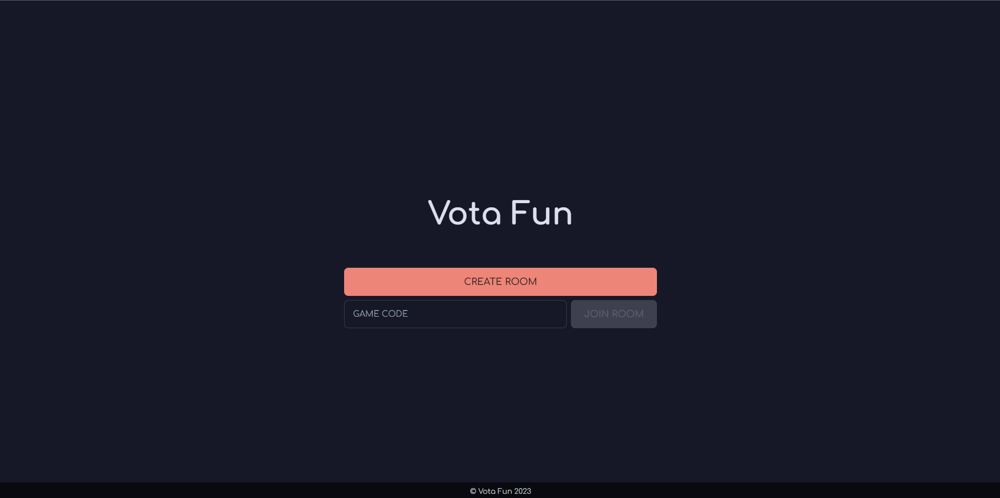
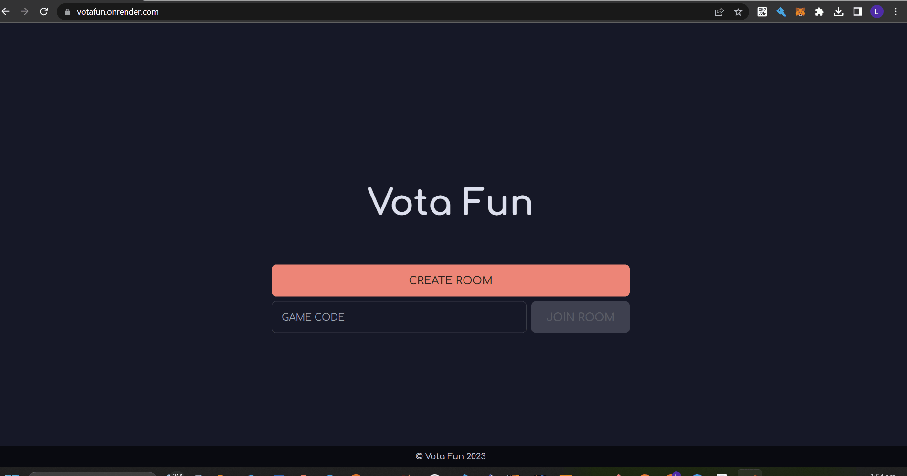

# 3002-TEL1-VotaFan

Votafun is a multiplayer Kahoot-style web application designed for groups of people. It aims to enhance decision-making efficiency, simplify communication, and foster collabaration between the group through a gamified platform. Create and join a room together, and vote your way to an activity which suits your requirements and preferences.

## Table of Contents

- [3002-TEL1-VotaFan](#3002-TEL1-VotaFan)
  - [Table of Contents](#table-of-contents)
  - [Features](#features)
  - [Getting Started](#getting-started)
    - [Prerequisites](#prerequisites)
    - [Installation](#installation)
  - [Usage](#usage)

## Features

- Next TypeScript Frontend w/ TailwindCSS
- Python Flask Backend
- Redis Database
- SocketIO
- OpenAI Integration (ChatGPT)

## Getting Started

### Prerequisites

- Some Python and JS/TS knowledge
- An understanding of websockets
- Docker (install [here](https://docs.docker.com/get-docker/))

### Installation

1. Input your `OPENAI_API_KEY` in docker-compose.yml
2. `docker-compose up -d`

## Usage

1. Create a room

2. Input a username and join the room

3. Invite your friends to the room!
